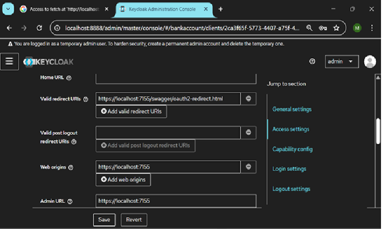
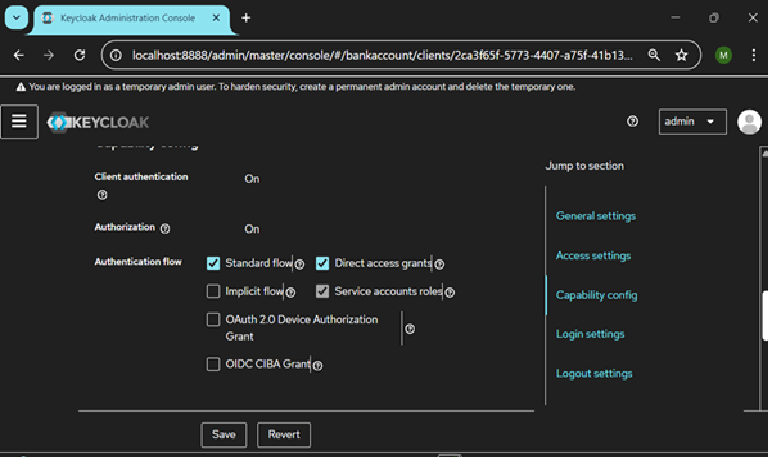
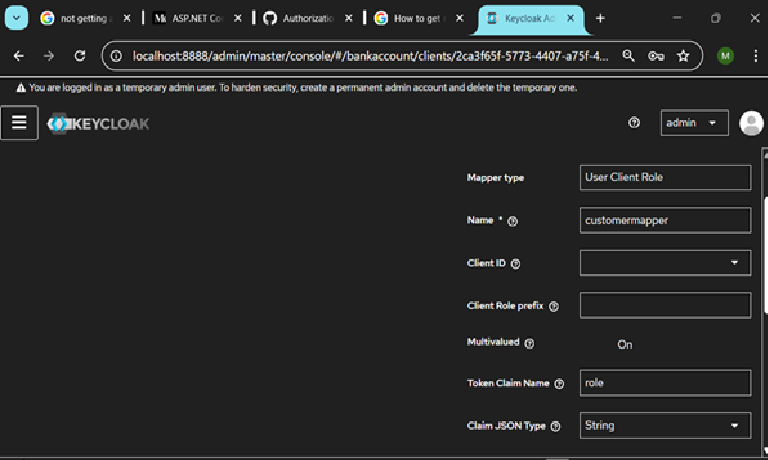
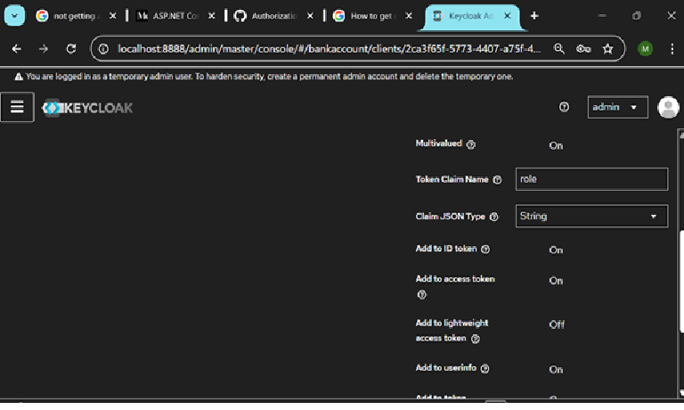

<h6> \## Welcome to Banking App DDD

This project is an experimental full-stack application where still I am working on frontend and I have combined several cutting-edge technologies and architectural patterns. Thanks for getting here! please <b>give a ⭐</b> if you liked the project. It motivates me to keep improving it.
--- </h6>
\## Architecture


\### High-Level System Architecture

<a href="images/BankingAppDDD-hl-architecture.png" target="\_blank">


</a>


\### Detailed Architecture

<a href="images/BankingAppDDD-detailed-architecture.png" target="\_blank">


</a>


```

├── Core

│   ├── Applications

│   ├── Common

│   ├── Domains

│   └── Infrastructures


├── Crosscutting

│   ├── ServiceClients

│   ├── ApiGateway

│   ├── IdentityServer

│   

│

├── Services

│   ├── CustomerManagement

│   ├── AccountManagement

│   ├── LoanManagement

|      └─ BankingApp.LoanManagement

│         ├── API

│         ├── Application

│         ├── Core(Domain)

│         └── Infrastructure

├── SPA

└── docker-compose

```


\- \*\*Domains\*\* <br/>

It defines the building blocks and abstractions used on all underlying projects. Its nature is very abstract, with no implementations.


\- \*\*Infrastructure\*\* <br/>

It holds some abstractions and implementation for infrastructure to be used by all microservices and underlying dependencies.


\- \*\*Applications\*\* <br/>

It defines the building blocks and abstractions used on all underlying projects and implementation for application to be used by all the services.


\- \*\*Common\*\* <br/>

It defines the building blocks and abstractions used on all underlying projects and implementation for application to be used by all the services.


\- \*\*Crosscutting\*\* <br/>

It contains building blocks and implementation to be used by all the services`.


\- \*\*Services\*\* <br/>

The microservices composing the backend are built to be as simple as possible, structured as a vertically sliced structure with  `API`, `Application`, `Core,` and `Infrastructure.`


&nbsp;   ```

&nbsp;     ├── BankingApp.CustomerManagement

&nbsp;     │   ├── Controller(API)

&nbsp;     │   ├── Application

&nbsp;     │   ├── Core(Domain)

&nbsp;     │   └── Infrastructure

&nbsp;   ```


&nbsp; - \*\*API\*\* <br/>

&nbsp; RESTful API for enabling communication between client and server.


&nbsp; - \*\*Application\*\* <br/> 

&nbsp; It orchestrates the interactions between the external world and the domain to perform application tasks through use cases by `handling commands and queries`. 


&nbsp; - \*\*Domain\*\* <br/>

&nbsp; A structured implementation of the domain through aggregates, commands, value objects, domain services, repository definitions, and domain events.


&nbsp; - \*\*Infrastructure\*\* <br/>

&nbsp; It is a supporting library for upper layers, handling infrastructural matters such as data persistence with \*implementing repositories\*, database mapping, and external integrations.


&nbsp; - \*\*SPA (Single Page Application)\*\* <br/>

&nbsp; A lightweight Angular-based `SPA` providing a functional and user-friendly UI on which still work is going on.


---


\## Technologies used

<ul>

&nbsp; <li>

&nbsp;   <a href='https://get.asp.net' target="\_blank">ASP.NET Core API</a> and <a href='https://learn.microsoft.com/en-us/dotnet/csharp/whats-new/csharp-12' target="\_blank">C# 12</a>

&nbsp;   for cross-platform backend with:

  <ul>

<li>.NET 8</li><br>
<li><b>Koalesce.OpenAPI 0.1.1-alpha.2</b></li><br>
<li>Ocelot 23.4.3</li><br>
<li>RabbitMq</li><br>
<li>Redis</li><br>
<li>Seq</li><br>
<li>seq-input-gelf</li><br>
<li>Mongodb</li><br>
<li>Entity Framework Core 8.0.15</li><br>
<li>EF Core Migrations</li><br>
<li>Npgsql.EntityFrameworkCore.PostgreSQL 8.0.11</li><br>
<li>ASP.NET Core Authentication JwtBearer 8.0.15</li><br>
<li>Keycloak 26.1.2</li><br>
<li>SwaggerGen/SwaggerUI 8.1.1</li><br>
<li>Microsoft.Kiota.\* 1.17.2</li>
</ul>
</li>
<li>
<a href='https://angular.io/' target="\_blank">Angular v19.2.7</a> and <a href='http://www.typescriptlang.org/' target="\_blank">TypeScript 5.5.4</a> for the frontend with:
<ul>

<li>Kiota 1.0.2</li><br>
<li>NgBootstrap 18.0.0/ Bootstrap 5.3.5</li><br>
<li>Font Awesome 6.7.2</li>
</ul>
</li>
</ul>
---
\## What do you need to run it 
\#### Running the microservices using Docker
The project was designed to be easily run within docker containers, hence all you need is 1 command line to up everything. Make sure you have `Docker` installed and have fun!
\- Download Docker: <a href="https://docs.docker.com/docker-for-windows/wsl/" target="\_blank">Docker Desktop with support for WLS 2</a>
&nbsp;   
<br/>
Few additional  setup is required to run keycloak
Go to solution directory where docker-compose.yml file exist and run below command
Execute the command from docker-compose path docker exec -it (containerid of postgresdb) /bin/bash
Then use psql -U keycloak -d keycloak_db 
Create User which u want to use for database creation using CREATE ROLE User WITH LOGIN PASSWORD 'TestUser1';
ALTER ROLE UserName WITH CREATEDB LOGIN REPLICATION ETC;—This will ceate new user in Login/Group Roles
After executing above command you create another database Keycloak with above user 

Similarly create mongodb
Execute the command from docker-compose path docker exec -it (containerid of mongodb) /bin/bash
root@2540e80be07d:/# mongosh -u root -p root123 --authenticationDatabase admin
    test> use admin
switched to db admin
admin> show dbs
admin   100.00 KiB
config  108.00 KiB
local    72.00 KiB
11)	admin> use myUserInfo
myUserInfo> db.createUser(
... ...    {
... ...      user: "TestUser",
... ...      pwd:  passwordPrompt(),   // or cleartext password
... ...      roles: [ { role: "readWrite", db: "myUserInfo" } ]
... ...    }
... ...  )
    After entering password use below statement
           myUserInfo> db.createCollection('UserInfo');
           myUserInfo>  db.UserInfo.insertOne({ UserId: 1234, UserName : "TestUser", Address: "TestAddress" });
    Now open studio 3T and create new connection using below connection string
    mongodb://TestUser@localhost:27017/myUserInfo?authsource=myUserInfo
 After creatung Database for keycloak you have to do a dns entry in /etc/hosts file as below
 127.0.0.1  keycloak --here keycloak is service name in docker-compose.yml file
 127.0.0.1  seq   -- here seq is service name in docker-compose.yml file
 After doing above dns entry in etc/hosts file now you can browse keycloak using http://keycloak:8080 and seq for logging on
 http://seq:8081/#/events
 Using keycloak admin console you follow the steps
 1)Log into admin console using admin user and password admin
 2)Create realms bankaccount
 3)Create Clients accountmanagementclient customermanagementclient loanclient identityproviderclient and apigatewayclient and follow below steps for each client 

 4) After creating clients do the following setup
 
 <br>
 
 <br>
 
 <br>
 
 <br>
 
 Using keycloak admin console you follow the steps
 1)Log into admin console using admin user and password admin
 2)Create realms bankaccount

We have to do above setup for each client using url http://localhost:5263
http://localhost:5157  http://localhost:5210  http://localhost:5273 and http://localhost:5000(this is the url for apigateway client)
Copy the client secrets from credential tab and paste it in appsetting.json file for each webapi client
After doing above setup create different role like Admin, Customer, Manager,Accountant,Operator and Underwriter in the role tab
Create scope in client scope tab select accountmanagementclient dedicated and other client and configure a new mapper for UserClient and save changes
Create User from User Menu where you have to enter firstname lame and Emailid and check the box email verified 
Create the User password using credential tab set new password and turn off the temporary option
Assign above created role to user Select Filter By Clients then choose the role and click assign

Using a terminal, run:
```console
&nbsp;$ docker-compose up or docker-compose up --build
``` 
You can also set the `docker-compose.dcproj` as a Startup project on Visual Studio if you want to run it while debugging. 
 After launching the webapi using swagger ui you need to authenticate and authorize the user clicking on authorize button on top right side lock icon and via keycloak by using the created user then execute the end point 


